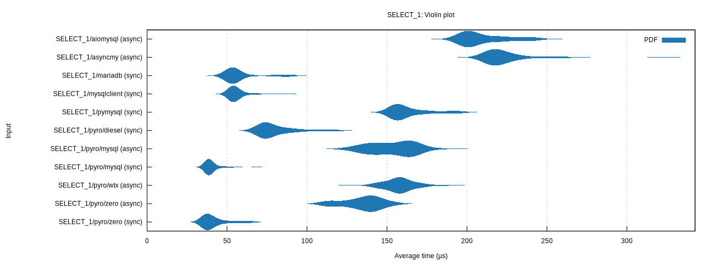
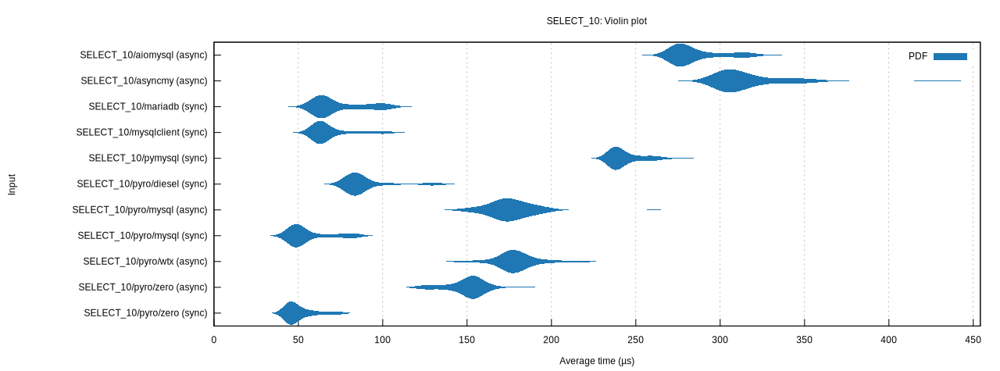
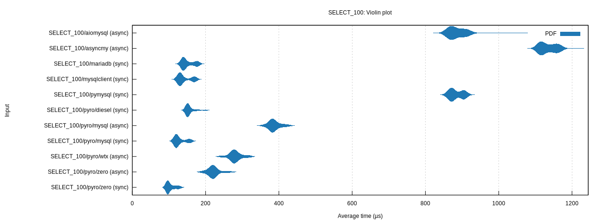
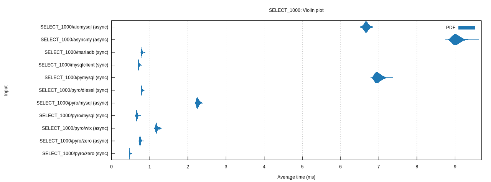

# Benchmark Results

This document contains performance benchmark results for pyro-mysql compared to other MySQL drivers.

## Raw Driver Benchmarks

### INSERT Operations

### SELECT 1 Row

### SELECT 10 Rows

### SELECT 100 Rows

### SELECT 1000 Rows

## SQLAlchemy (Sync) Benchmarks

### SQLAlchemy INSERT

### SQLAlchemy SELECT 1 Row

### SQLAlchemy SELECT 10 Rows

### SQLAlchemy SELECT 100 Rows

### SQLAlchemy SELECT 1000 Rows

## SQLAlchemy Async Benchmarks

### SQLAlchemy Async INSERT

### SQLAlchemy Async SELECT 1 Row

### SQLAlchemy Async SELECT 10 Rows

### SQLAlchemy Async SELECT 100 Rows

### SQLAlchemy Async SELECT 1000 Rows

