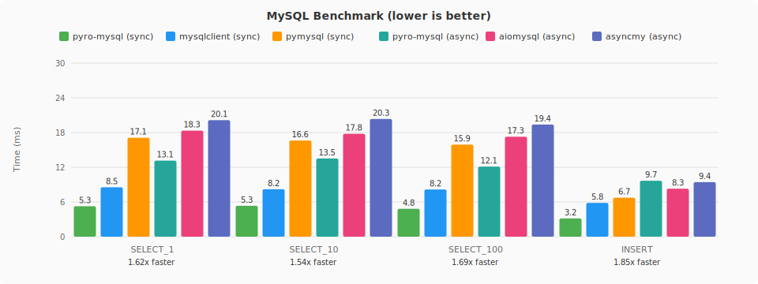
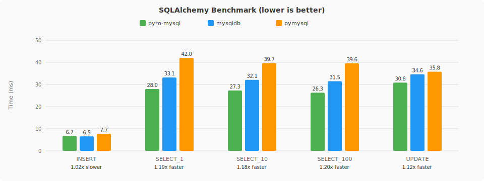

# pyro-mysql

A high-performance MySQL driver for Python, backed by Rust.

- [Documentation](https://elbaro.github.io/pyro-mysql/)
- [Benchmarks](https://github.com/elbaro/pyro-mysql/blob/main/BENCHMARK.md)

